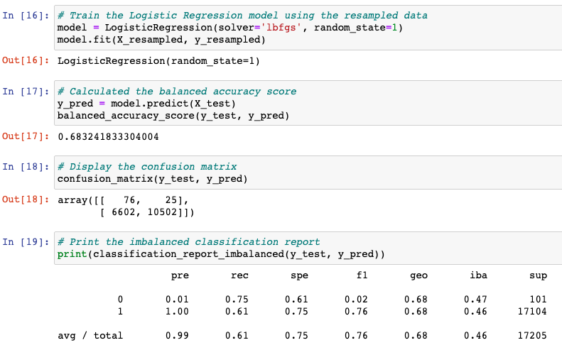

# Credit_Risk_Analysis
Module17

# Overview

LendingClub needs to predict the credit card risk for futures leads. The real-life problem is that the data will always unbalanced. We need to balanced the data for making the prediction analysis and detect possible high-risk loans.

# Results

## Oversampling 

    Naive Random Oversampling results: Our balanced accuracy test it 68%, the precision for the high_risk it 1%, the recall is 75%, and the F1 is 2%

#### Code

______________

    SMOTE Oversampling results: Our balanced accuracy test it 65%, the precision for the high_risk it 1%, the recall is 62%, and the F1 is 2%

#### Code

______________

## Undersampling 

    ClusterCentroids Undersampling results: Our balanced accuracy test it 53%, the precision for the high_risk it 1%, the recall is 48%, and the F1 is 1%

#### Code

______________

## Combination (Over and Under) Sampling

    SMOTEENN sampling results: Our balanced accuracy test it 65%, the precision for the high_risk it 1%, the recall is 71%, and the F1 is 2%

#### Code

______________

## Ensemble Learners

    Balanced Random Forest Classifier results: Our balanced accuracy test it 75%, the precision for the high_risk it 3%, the recall is 65%, and the F1 is 5%

#### Code

______________

    Easy Ensemble AdaBoost Classifier results: Our balanced accuracy test it 93%, the precision for the high_risk it 9%, the recall is 92%, and the F1 is 16%

#### Code

______________

# Summary
The best model was Easy Ada, because it has the highest accuracy test in 93%, the precision un 9%, the recall in 92% and the F1 is 16%. 

The not-good models were Naive, SMOTE, and Cluster centroids, because they have very low accuracy-test points.

There are 3 variables that we can drop for the data:
    1. pymnt_plan
    2. hardship_flag
    3. debt_settlement_flag

The reason is that these variables have the same value in all data sets.
